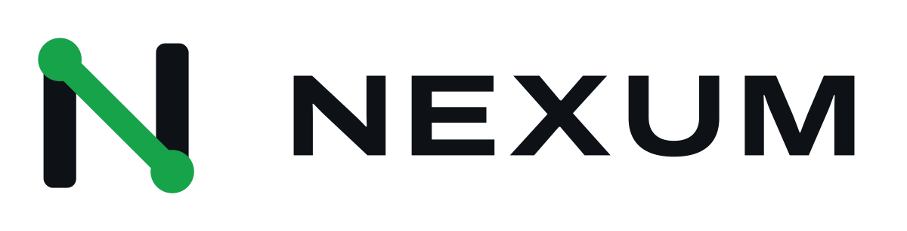
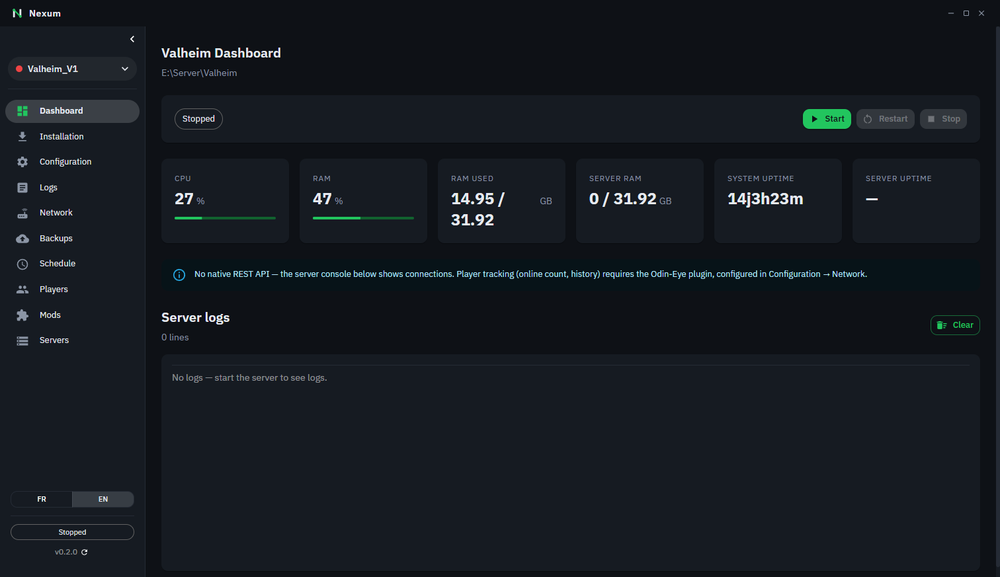
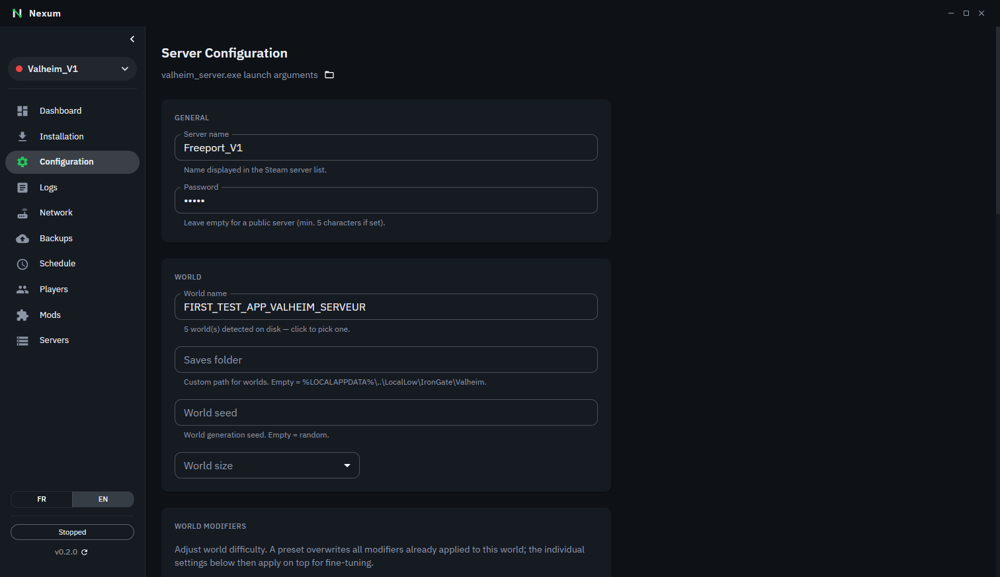
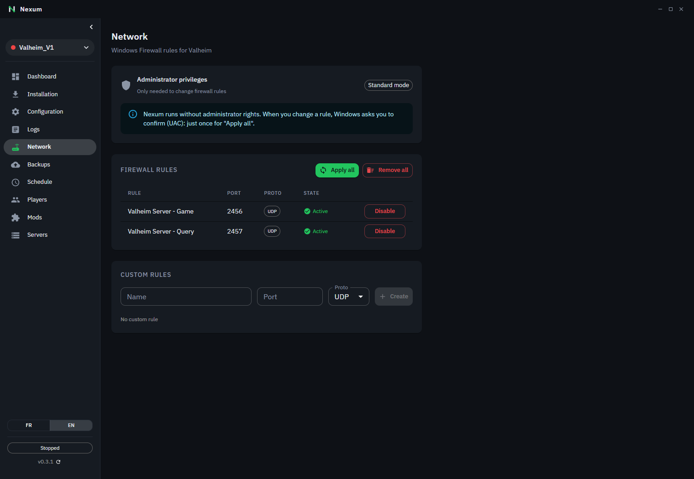
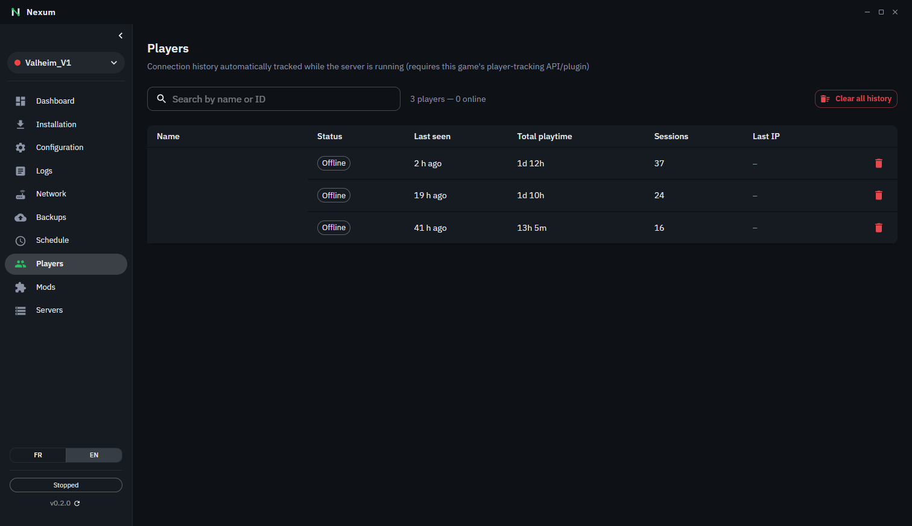

<h1 align="center">
  <picture>
    <source media="(prefers-color-scheme: dark)" srcset="docs/images/nexum-logo-dark-bg-1200.png">
    
  </picture>
</h1>

🇬🇧 [English](README.md) | 🇫🇷 Français

Gestionnaire de bureau pour serveurs dédiés de jeux vidéo. Compatible avec **Palworld**, **Valheim** et **Astroneer**.

## Fonctionnalités

- **Plusieurs serveurs, plusieurs jeux** : Palworld, Valheim et Astroneer depuis une seule app, sans ligne de commande
- **Installation automatique** de SteamCMD et du serveur, ou **import d'un serveur déjà installé** (jeu et mondes détectés automatiquement)
- **Démarrage / arrêt / redémarrage** avec arrêt propre (API REST Palworld, CTRL+C Valheim) pour ne pas corrompre les sauvegardes
- **Surveillance en temps réel** : CPU, RAM, uptime, joueurs en ligne, console du serveur
- **Éditeur de configuration** visuel pour chaque jeu (presets de difficulté Palworld, modificateurs de monde Valheim)
- **Mods Valheim** : parcourir, installer et mettre à jour depuis **Thunderstore et Hexium**, dépendances automatiques, import de profils r2modman/Gale, éditeur de configs BepInEx, mods dépréciés signalés
- **Suivi des joueurs** : historique, temps de jeu, sessions (Palworld natif, Valheim via Odin-Eye) ; kick / ban / unban sur Palworld
- **Firewall Windows** : règles créées automatiquement + règles personnalisées
- **Sauvegardes** automatiques planifiées avec rotation
- **Redémarrage planifié** quotidien avec annonce en jeu et sauvegarde
- **Mise à jour de l'app intégrée**
- **Interface bilingue** français / anglais

## Captures d'écran

<table>
  <tr>
    <td> Dashboard</td>
    <td> Mods (Thunderstore & Hexium)</td>
  </tr>
  <tr>
    <td> Configuration du serveur</td>
    <td> Règles de pare-feu</td>
  </tr>
  <tr>
    <td> Historique des joueurs</td>
    <td></td>
  </tr>
</table>

## Installation

Téléchargez la dernière version depuis [Releases](https://github.com/THEREALM00D/nexum/releases) :

- **Installateur** : `nexum-{version}-setup.exe`
- **Portable** : `nexum-{version}-portable.exe`

> L'application requiert les **droits administrateur** pour gérer les règles du firewall Windows.

## Démarrage rapide

1. Lancez **Nexum**
2. Allez dans **Installation**
3. Cliquez sur **Installer SteamCMD** (téléchargement automatique)
4. Choisissez un dossier de destination et installez le serveur du jeu souhaité — ou, s'il est déjà installé, allez dans **Serveurs → Ajouter un serveur** et choisissez son dossier
5. Allez dans **Dashboard** et cliquez sur **Démarrer**

Voir [docs/installation.fr.md](docs/installation.fr.md) pour le guide complet.

## Documentation

- [Installation](docs/installation.fr.md)
- [Dashboard](docs/dashboard.fr.md)
- [Configuration du serveur](docs/configuration.fr.md)
- [Réseau et firewall](docs/network.fr.md)
- [Sauvegardes](docs/backups.fr.md)
- [Planification](docs/scheduling.fr.md)
- [Logs](docs/logs.fr.md)
- [Suivi des joueurs Valheim (Odin-Eye)](docs/valheim-players.fr.md)
- [Mods Valheim](docs/valheim-mods.fr.md)
- [Architecture technique](CLAUDE.md)

## Stack technique

- Electron 44, React 19, MUI 9, TypeScript 6, Vite 5

## Licence

Open source sous licence [GNU General Public License v3.0 ou ultérieure](LICENSE). Vous êtes libre d'utiliser, étudier, modifier et partager le logiciel ; toute version modifiée que vous distribuez doit rester open source sous la même licence.

## Contribuer

La branche `main` est protégée : toute contribution passe par une Pull Request, et seul le mainteneur du projet peut la merger.

Les titres de PR doivent suivre [Conventional Commits](https://www.conventionalcommits.org/) (`feat: …`, `fix: …`, `chore: …`), ce qui est vérifié en CI. Les versions et le [CHANGELOG](CHANGELOG.md) sont générés à partir de ces titres par [release-please](https://github.com/googleapis/release-please-action) : `fix` fait monter la version patch, `feat` la version mineure, et une release est publiée en mergeant la PR de release qu'il ouvre.
