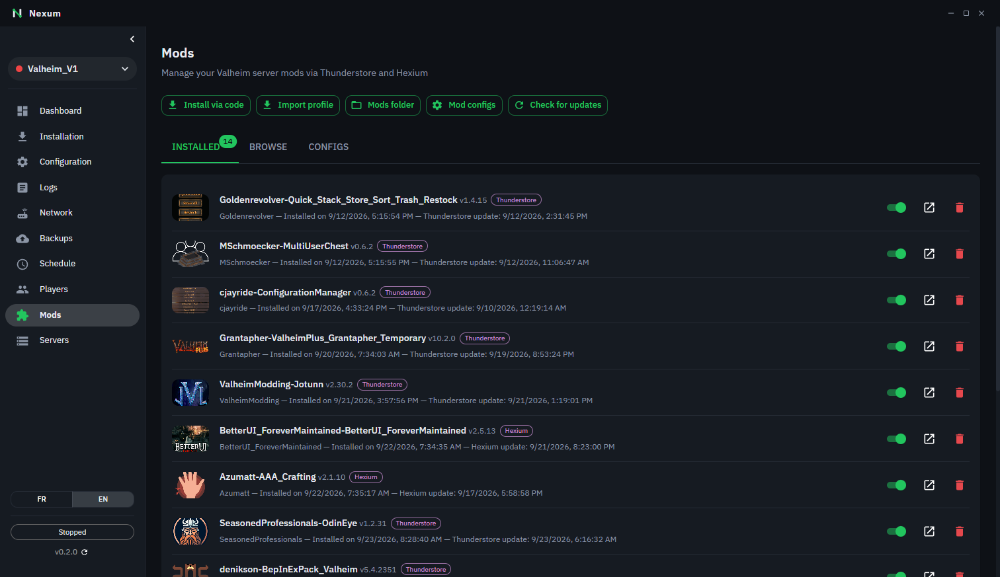

# Mods Valheim

🇬🇧 [English](valheim-mods.md) | 🇫🇷 Français

La page **Mods** d'un serveur Valheim permet d'installer, mettre à jour et configurer des mods BepInEx depuis deux registres : [Thunderstore](https://thunderstore.io/c/valheim/) et [Hexium](https://valheim.hexium.gg/).

## BepInEx

La plupart des mods Valheim nécessitent **BepInEx**. Si Nexum ne le détecte pas dans le dossier du serveur, un bandeau le signale avec un bouton **Installer BepInEx**.

> Les mods ne sont chargés qu'au démarrage du serveur : redémarrez-le après toute installation, désinstallation ou activation/désactivation.

## Onglet Installés

Liste des mods présents dans `BepInEx/plugins/`, avec pour chacun :

- un badge indiquant sa source (**Thunderstore**, **Hexium**, ou **Manuel** pour un mod copié à la main hors de Nexum) ;
- un interrupteur **Activé / Désactivé** (le mod est réellement déplacé hors de `plugins/` quand il est désactivé) ;
- **Désinstaller**, et un lien vers la page du mod sur son registre.

### Mises à jour

**Vérifier les mises à jour** compare chaque mod à la dernière version publiée. Un badge « vX.Y dispo » apparaît quand une mise à jour existe, et **Tout mettre à jour** les installe d'un coup.

Si la nouvelle version se trouve sur l'**autre** registre (un auteur qui a quitté Thunderstore pour Hexium, par exemple), le badge l'indique (« dispo sur Hexium ») et le bouton précise le changement de source avant l'installation.

### Mods dépréciés

Un badge rouge **Déprécié** signale un mod que son auteur a marqué comme déprécié sur son registre : il n'est plus maintenu et peut cesser de fonctionner après une mise à jour du jeu. Survolez le badge pour le détail — si une version maintenue existe sur l'autre registre, l'infobulle le dit et il suffit d'utiliser la mise à jour proposée.

Les mods installés manuellement ne sont pas concernés : sans registre connu, Nexum ne peut vérifier ni leur statut ni leurs mises à jour.

## Onglet Parcourir

- Choisissez le registre (**Thunderstore** ou **Hexium**) : les deux listes sont indépendantes.
- Onglets **Tendances**, **Nouveaux**, **Mis à jour**, ou recherche libre. Les mods dépréciés n'apparaissent que dans la recherche, en fin de liste et avec le badge **Déprécié**.
- Installez la dernière version en un clic, ou choisissez une version précise via **Versions**.
- Si le mod a des dépendances non installées, Nexum propose de les installer (**Tout installer**), y compris quand elles viennent de l'autre registre.

### Installer via un code ou un profil

- **Installer via un code** : collez un code `Auteur-NomDuMod-Version` et choisissez son registre (le même code peut exister sur les deux).
- **Importer un profil** : collez un code de profil exporté depuis r2modman, Gale, Thunderstore ou Hexium, ou importez un fichier `.r2z`. Les profils qui mélangent des mods Thunderstore et Hexium sont supportés.

## Onglet Configs

Liste les fichiers `.cfg` générés par les mods dans `BepInEx/config/` (un mod crée son fichier au premier lancement du serveur).

- Filtrez la liste par nom de fichier, puis cliquez sur **Éditer**.
- L'éditeur affiche chaque paramètre avec le bon type de champ (case à cocher, liste, nombre borné…) d'après les commentaires générés par BepInEx, et sa valeur par défaut.
- Le champ de recherche filtre les paramètres par nom, description ou section.
- Seules les lignes de valeur modifiées sont réécrites : le reste du fichier (commentaires, ordre) est conservé.
- Si vous fermez un fichier modifié sans l'avoir enregistré, Nexum demande confirmation : **Continuer l'édition**, **Quitter sans enregistrer** ou **Enregistrer**.

> Comme pour les mods, les changements de config ne sont pris en compte qu'au redémarrage du serveur.
